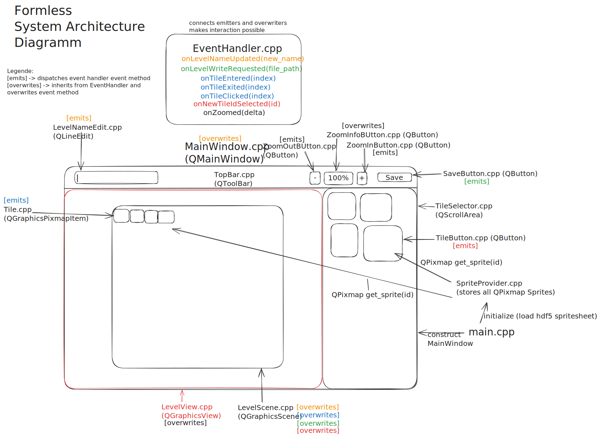

# Level Editor Doku

## System Architecture
The LevelEditor UI is built of many classes that inherit from a QWidget.  
The Composition of these classes forms the Application.  
Appart from main.cpp and the QWidget classes, level editor also makes use of  
the SpriteProvider and EventHandler class.  
The SpriteProvider is initialized at the beginning of the program in the main function
and can later be used to retrieve any sprite (QPixmap) by tile id from anywhere in the application.  
The EventHandler class is the heart of the application. It allows any Class to emit or receive events from anywhere in the program.  
To receive Events from EventHandler a class needs to inherit from EventHandler and overwrite the event method for the event it wants to handle.  
The available event methods, as well as the info on which class emits which event method and which class overwrites which event method can be seen in the below diagramm.  
The formless diagramm below demonstrates how the classes form the Application.  
For more details on the individual classes, take a look at the documentation in their header files.
